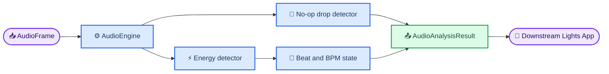

# Lights Audio Engine architecture

_M0/M1 analysis and M2A capture boundaries for contributors._

---

## 📋 Responsibility boundary

This repository owns audio-domain input validation, minimal analysis, typed events, and
streaming analysis state for party-music reactive lighting. The target includes modern
electronic production, mainstream pop, party-oriented hip-hop, and dynamically variable
older dance, funk, disco, and pop recordings. It returns machine-consumable values and
contains no knowledge of scenes, lighting presets, fixtures, or output protocols.

The Lights App may interpret an `AudioAnalysisResult`, but it must not depend on detector
implementation details. Audio-device and file ingestion remain outside this M1 processing
boundary so later sources can produce the same `AudioFrame` contract.

## ⚙️ Processing flow



`AudioEngine.process(frame)` is synchronous and stateful. Each call returns events detected
for that frame plus the current BPM estimate. No callback, wall clock, global state, device
handle, consumer code, or lighting logic is involved.

## 🎙️ Experimental hardware-probe sidecar

M1.5 adds `lights_audio_engine.probe` outside the processing flow and stable engine boundary.
The developer CLI uses a lazy `SoundDeviceBackend` adapter around sounddevice/PortAudio,
checks run-local input configurations, and aggregates signal diagnostics in constant memory.
It never retains complete PCM and never constructs `AudioFrame` or calls `AudioEngine`.

```text
Windows audio hardware
    → sounddevice / PortAudio
    → SoundDeviceBackend
    → AudioProbeBackend
    → CaptureDiagnostics
    → developer CLI
```

The sidecar reports device indexes and names for investigation only. PortAudio does not make
those observations stable across enumeration, replug, or reboot. M2A now defines the
hardware-independent `AudioSource` and frame-assembly boundary. Endpoint identity, loopback,
resampling, reconnect, watchdog behavior, and the actual capture backend remain M2B decisions
informed by physical-hardware evidence.

## Production capture boundary (M2A)

`lights_audio_engine.capture` converts backend-neutral floating-point blocks into the stable
`AudioFrame` contract without opening hardware or depending on a capture backend. `AudioSource`
is a synchronous blocking-pull protocol. `FrameAssembler` validates blocks, applies an explicit
mono channel policy, clips or rejects out-of-range samples, and derives each frame start from an
integer cumulative sample count. The default `MonoPassthrough` policy rejects multichannel input;
`SelectChannel` and `AverageChannels` require an explicit configuration choice.

Overflow, dropped blocks, sample-rate changes, and restarts are yielded as `Discontinuity`
values. The affected block is not converted into a gapped frame, assembler timing and observed
channel count rebase, and `run_engine` resets `AudioEngine` before processing the next logical
stream. The driver is the only M2A component that knows both source and engine contracts. The
M1.5 probe remains a separate diagnostic sidecar and is not a production source. M2B will supply
the evidence-backed hardware/backend implementation without changing these M2A boundaries.

## 📊 Domain contracts

| Model | Contract |
| --- | --- |
| `AudioFrame` | Owned, read-only `float64` mono samples, configured sample rate, non-negative start time |
| `BeatEvent` | Sample-derived timestamp, detector-relative transient-energy strength, monotonic index |
| `DropEvent` | Stable future-facing event shape; not emitted by the M1 detector |
| `AudioAnalysisResult` | Optional BPM, immutable beat/drop tuples, normalized current RMS level |
| `AudioEngineConfig` | Frozen sample-rate, sensitivity, BPM, window, and bounded-history settings |

The `AudioFrame` constructor copies caller-owned input, rejects multidimensional, empty,
integer, non-finite, or out-of-range samples, and makes the engine-owned copy read-only.

## ⏰ Timing and sequencing

All timing is supplied or derived; analysis never reads the wall clock.

For a transient peak at absolute stream sample index `n`:

```text
event_timestamp_seconds = stream_start_time_seconds + n / sample_rate_hz
```

The detector assembles fixed-duration analysis windows across calls, so splitting the same
contiguous samples into different frame sizes does not change detected transient timestamps.
The stream origin is stored once and all later times use integer sample indexes; callback-size
differences therefore cannot accumulate different floating-point frame-time drift.
After the first frame, the next frame start must match the prior end within half a sample.
A gap, overlap, or sample-rate change fails clearly. `reset()` begins a new logical stream,
clears partial windows and BPM history, and restarts `beat_index` at zero.

## 🎚️ Sensitivity and beat detection

Sensitivity is finite and normalized to `0.0` through `1.0`. Higher sensitivity means more
reactivity and a lower effective detection threshold. For each fixed RMS window, the M1
detector uses:

```text
absolute_gate = 0.30 - 0.25 * sensitivity
relative_gate = median(recent_rms) * (3.0 - 1.5 * sensitivity)
threshold = max(absolute_gate, relative_gate)
```

An onset crossing above the threshold becomes a beat candidate when it is not inside the
minimum interval implied by `max_bpm`. Event strength is the window RMS clipped to `1.0`.
It is detector-relative transient energy, not calibrated musical salience or confidence, so
`BeatEvent` exposes no confidence field. This detector proves the boundary and deterministic
state model only.

## 🔄 BPM and bounded state

The default supported range is `50.0–240.0 BPM`; both limits are configurable, finite,
positive, and ordered. The configured maximum also determines the detector refractory
interval. The engine stores at most `bpm_history_size` beat timestamps. BPM remains
unavailable until at least three beats produce two valid adjacent intervals. It filters
intervals outside the configured range, takes the median of the remaining intervals, and
converts that interval to beats per minute.

The estimate preserves the directly observed interval. For example, `0.3` seconds between
accepted beats is approximately `200 BPM`, and the M1 engine does not automatically fold it
to `100 BPM`. Half/double-time ambiguity is real, especially across genres, but future
tempo-candidate ranking must use additional evidence rather than a conventional-pop bias.

Energy history is bounded by `energy_history_seconds`, event collections exist only in the
current result, and no audio history is persisted outside the detector's partial fixed window.

## 🧩 Extension seams

The current public result model does not need speculative fields. `AudioFrame` remains the
stable input contract, internal detectors own feature extraction, and `AudioEngine` composes
their immutable outputs. A later evidence-backed milestone can add optional or nested result
models without changing frame ownership, timing, reset, or detector boundaries.

Likely future features include overall and frequency-band energy, spectral flux/onset
strength, tempo confidence and candidates, rhythmic phase, downbeat/bar estimates, broad
musical intensity, and structure such as builds, drops, and breakdowns. None is represented
until its semantics and fixtures are defined.

## 🚫 Deliberate non-goals

The stable M0/M1 engine does not implement WAV/file sources, paced playback, production
microphone capture, reconnect logic, advanced spectral or tempo tracking, drop heuristics,
calibrated confidence, band analysis, networking, services, GUIs, databases, scenes, presets,
DMX, sACN/E1.31, Art-Net, WLED, LedFx control, or ILDA output. The M1.5 WASAPI/
sounddevice/PortAudio device probe is diagnostic-only and remains outside that engine.

Deterministic real-track replay and richer spectral analysis remain separately scoped future
milestones. Neither belongs in this foundation hardening pass.

## 🧪 Verification strategy

Core tests synthesize signals in memory. They cover invalid boundaries, silence, transient
timestamps, sensitivity, amplitude scaling, exact chunk invariance, BPM evidence and bounds,
the `80–240 BPM` party-music matrix, reset, repeatability, no-op drop behavior, and the exact
package-root public surface. Windows CI runs the complete suite, Ruff, and strict BasedPyright
on supported Python versions.
