# M2C detector bake-off

_Deterministic offline evaluation of streaming beat/onset detector candidates_

---

## 🎯 Scope and status

M2C captures the exact normalized mono `float64` values yielded by the live capture source,
replays those samples through three evaluation-only candidates, and scores their beat events
against human point labels. It does not replace the production `EnergyBeatDetector`, change the
stable package-root API, or make the historical M2B run replayable. M2B retained JSONL evidence,
not raw PCM; the first `--capture-pcm` run creates the first reproducible M2C baseline.

Real captured audio, `.npy` files, annotations, and generated reports remain local evidence. The
repository ignores `m2c-artifacts/` and must not contain copyrighted or private captured audio.

```mermaid
flowchart LR
    accTitle: M2C evaluation data flow
    accDescr: Exact post-assembler frames are saved with metadata, replayed without another frame assembler, evaluated by three sidecar candidates, and compared with beat point labels.

    live_source["🎙️ Live diagnostic source"] --> capture_tap["📥 Exact frame tap"]
    capture_tap --> artifact["💾 Float64 NPY and JSON"]
    artifact --> replay["🔄 Stream-relative replay"]
    labels["🏷️ Human beat labels"] --> scoring["📊 Match and score"]
    replay --> candidates["⚙️ Candidates A, B, and C"]
    candidates --> scoring
    scoring --> decision{"🔍 Quality gates pass?"}
    decision -->|Yes| recommendation["✅ Recommend candidate"]
    decision -->|No| no_candidate["⚠️ No production candidate yet"]

    classDef boundary fill:#ede9fe,stroke:#7c3aed,stroke-width:2px,color:#3b0764
    classDef process fill:#dbeafe,stroke:#2563eb,stroke-width:2px,color:#1e3a5f
    classDef result fill:#dcfce7,stroke:#16a34a,stroke-width:2px,color:#14532d
    classDef warning fill:#fef9c3,stroke:#ca8a04,stroke-width:2px,color:#713f12

    class live_source,labels boundary
    class capture_tap,artifact,replay,candidates,scoring process
    class recommendation result
    class decision,no_candidate warning
```



## 💾 Authoritative artifact

The artifact pair uses the same basename:

| File | Role | Authoritative |
| --- | --- | :---: |
| `<name>.npy` | One-dimensional NumPy `float64` sample array | Yes |
| `<name>.json` | Schema and interpretation manifest | Yes |
| Optional PCM16 WAV | Human listening or annotation companion | No |

The JSON schema version is `1`. Its fields are:

| Field | Meaning |
| --- | --- |
| `schema_version` | Manifest contract version |
| `label` | Recording identifier |
| `sample_rate_hz` | Exact sample timebase |
| `sample_count` | Number of stored mono samples |
| `dtype` | Required value `float64` |
| `frame_lengths` | Original yielded frame lengths in order |
| `segments` | Contiguous logical stream ranges and original timing |
| `sample_data_sha256` | SHA-256 of the authoritative `.npy` file |
| `authoritative` | Required interpretation marker |

Each segment records `start_sample`, `sample_count`, `original_start_time_seconds`, and the
`discontinuity_before` reason when applicable. Evaluation time always rebases the selected
segment to `0.0`; original live time is metadata only. A multi-segment artifact requires an
explicit segment selection and is never silently stitched.

`read_artifact()` verifies the checksum before loading and rejects unsupported schemas, dtype or
sample-count mismatches, malformed metadata, and unreadable/truncated sample files. A written and
reloaded sample array must satisfy `np.array_equal`.

## 🎙️ Capture and replay

Create a local evidence directory and start the existing diagnostic with the additive tap:

```powershell
$m2cDir = Join-Path $env:USERPROFILE 'Documents\lights-audio-engine-m2c'
New-Item -ItemType Directory -Force -Path $m2cDir

uv run python -m lights_audio_engine.diagnostic `
  --device "<FRESH_DEVICE_SELECTOR>" `
  --sample-rate 48000 `
  --channels 1 `
  --label "holdout-track-01" `
  --capture-pcm (Join-Path $m2cDir 'holdout-track-01.npy')
```

The tap observes `AudioFrame` values after existing channel conversion and normalization and
before `AudioEngine.process()`. It yields the same frame and discontinuity objects unchanged.
Without `--capture-pcm`, diagnostic behavior is unchanged and no artifact is created.

`ReplayAudioSource` slices a selected stored segment directly into `AudioFrame` values. It does
not invoke `FrameAssembler`. Frame starts are derived as `segment_sample_offset / sample_rate`,
so 240, 480, and 960 frames correspond to 5, 10, and 20 ms at 48 kHz without clock drift.

## 🏷️ Beat references

Reference files are UTF-8 tab-separated point labels. Blank lines and lines beginning with `#`
are ignored. A file containing no point events is an explicit zero-beat reference.

```text
0.500000	beat
0.928571	beat
1.357143	beat
```

The first field is a finite, non-negative stream-relative timestamp in seconds. The second field
is a non-empty human label. Timestamps must be strictly increasing. Interval labels, malformed
rows, duplicate times, decreasing times, negative values, and non-finite values are rejected.
Labels must use the exact sample timebase of the associated artifact segment.

## ⚙️ Candidates and causality

| Candidate | Experimental method | Cadence and lookahead |
| --- | --- | --- |
| A: `baseline` | Unchanged `EnergyBeatDetector` wrapper | Existing 20 ms windows |
| B: `broadband` | Positive short-hop RMS novelty, adaptive median threshold | 5 ms; one hop |
| C: `multiband` | Positive band-spectrum novelty fused before peak picking | 5 ms; one hop |

B and C process fixed 240-sample hops independent of delivery block size. Both use past samples
only, apply a candidate-specific frozen configuration, confirm an online local maximum with the
next hop, and use the configured 240 BPM maximum to impose a 250 ms refractory interval. C
zero-pads each causal 5 ms hop to a 960-point FFT for deterministic band resolution; zero-padding
does not inspect future samples. Its low, mid, and high evidence is fused into one novelty value
before peak picking, so coincident active bands cannot create one event per band.

## 📏 Matching, scoring, and latency

Matching visits detections chronologically and assigns each to the earliest still-unmatched
reference within the inclusive tolerance, default `±50 ms`. One detection and one reference can
participate in at most one match. An unmatched detection within tolerance of a reference already
matched by another detection is counted as both a false positive and the `short_doubles` subtype.

Per-track and pooled reports include counts, precision, recall, F1, signed errors, median signed
bias, absolute errors, median and p95 absolute error, longest consecutive missed-reference run,
processing time, and decision latency. Pooled count metrics are micro-averaged; per-track metrics
remain visible so a strong pooled score cannot conceal a failed recording.

For an event returned while processing a frame:

```text
emitted_stream_time = frame_start + frame_length / sample_rate
decision_latency = emitted_stream_time - event_timestamp
```

The emitted time is the end of all stream audio available when the candidate returned the event.
This includes B/C's confirmation hop and prevents a detector from appearing fast by backdating
its assigned timestamp. Runtime is a benchmark observation and is not expected to be bitwise
repeatable; detector events and score values are deterministic.

## 🧪 Dataset and command

Freeze candidate configuration before final holdout evaluation. A schema-version `1` dataset
manifest declares every track as `development` or `holdout`. Relative paths resolve from the
dataset manifest directory.

For a multi-segment artifact, each track must include `segment_index` (zero-based). Reference
timestamps are always relative to the selected segment's `0.0` origin.

```json
{
  "schema_version": 1,
  "tracks": [
    {
      "label": "development-track-01",
      "split": "development",
      "artifact_path": "development-track-01.npy",
      "reference_path": "development-track-01.txt",
      "segment_index": 0
    },
    {
      "label": "holdout-track-01",
      "split": "holdout",
      "artifact_path": "holdout-track-01.npy",
      "reference_path": "holdout-track-01.txt"
    }
  ]
}
```

Run all three candidates at 5, 10, and 20 ms delivery:

```powershell
uv run python -m lights_audio_engine.evaluation `
  (Join-Path $m2cDir 'dataset.json') `
  --output (Join-Path $m2cDir 'report.json')
```

The recommendation considers only 240-frame holdout results and requires pooled precision and
recall of at least `0.90`, every holdout track recall of at least `0.85`, no missed run longer
than two beats, p95 decision latency no greater than `15 ms`, and zero short doubles. When no
candidate passes every fixed gate, the report says `NO PRODUCTION CANDIDATE YET`.

## 🔬 Manual evidence remaining

Implementation tests use deterministic synthetic pulses and deliberately degraded candidates.
Completing the real-audio milestone still requires:

1. Capture representative development and untouched holdout music sections.
2. Create beat point labels against each exact artifact timebase.
3. Freeze B/C parameters before the holdout run.
4. Run the complete multi-candidate bake-off.
5. Inspect per-track failures, pooled metrics, timing accuracy, latency, and quality gates.
6. Record the evidence without committing captured audio or local artifacts.
7. Optionally use the [Librosa offline benchmark](m2c-librosa-offline-benchmark.md) as advisory
   review material; it cannot supply a production recommendation.

Until those steps are complete, M2C has an implemented evaluation system but no evidence-backed
production-detector winner.
