# Librosa offline benchmark — design spec

_Evaluation-only, advisory annotation/benchmark aid layered on top of the already-merged M2C
detector bake-off. Planning artifact only — no production code has been written._

- **Status:** approved, pending implementation
- **Branch:** `feat/librosa-offline-benchmark`
- **Author context:** Claude Code, planning/independent-review role per [docs/ai/WORKFLOW.md](../../ai/WORKFLOW.md)
- **Depends on:** M2C detector bake-off (merged to `main`, see [docs/m2c-detector-bakeoff.md](../../m2c-detector-bakeoff.md))
- **Revision:** incorporates final decisions below; supersedes the first draft's open questions on
  extra naming, latency representation, Audacity scope, CI/dev install, the basedpyright
  exception, and file-count footprint.

## Decisions locked for this revision

1. Optional-dependency extra name is `librosa` (not `benchmark`/`eval`).
2. Librosa stays fully advisory/offline and structurally isolated from M2C Candidates A/B/C and
   from `bakeoff.py`'s production recommendation gates.
3. Human/DJ point-label annotations remain the sole authoritative ground truth; Librosa output is
   never auto-promoted to that status.
4. Librosa decision-latency is represented as a literal "not applicable" string — never as `0.0`,
   never inferred from any causal-style computation. §7 specifies the exact mechanism.
5. The Audacity label file is a convenience export adapter only. The canonical data model is the
   `LibrosaAnalysis` dataclass and the `LibrosaBenchmarkReport` JSON schema; nothing about them is
   Audacity-shaped. §2 and §3 make this explicit.
6. `librosa` is **not** added to the mandatory CI job or the `dev` extra. Mandatory CI keeps
   installing only `.[dev]`.
7. No `# pyright: ignore` is pre-authorized by this spec. §4 specifies the exact empirical
   procedure implementation must follow before adding (or not adding) any suppression.
8. Footprint reduced from 8 source / 5 test files to **7 source / 4 test files** by merging the
   scoring wrapper into the report module (§3), since compute-and-serialize is one cohesive
   responsibility at this feature's size. The two boundaries that are kept separate
   (`_librosa_backend.py`'s typing isolation, and `export.py`'s no-`librosa`-needed testability)
   are called out explicitly as the ones that matter — everything else is a candidate for merging.

---

## 1. Relevant current files/interfaces

Inspected directly from source (not assumed):

| File | Role | Reused as-is |
| --- | --- | :---: |
| [`evaluation/artifact.py`](../../../src/lights_audio_engine/evaluation/artifact.py) | `read_artifact(path) -> PcmArtifact` loads the authoritative normalized mono `float64` `.npy` + JSON manifest pair, verifies checksum/schema, returns `.samples`, `.sample_rate_hz`, `.segments: tuple[SegmentInfo, ...]`, `.label`. Raises `ArtifactError`. | Yes |
| [`evaluation/reference.py`](../../../src/lights_audio_engine/evaluation/reference.py) | `parse_reference(path) -> tuple[float, ...]` parses strictly-increasing tab-separated `timestamp\tlabel` human point labels. Raises `ReferenceFormatError`. | Yes |
| [`evaluation/matching.py`](../../../src/lights_audio_engine/evaluation/matching.py) | `match_events(references, detections, *, tolerance_seconds=0.05) -> MatchResult`. Chronological, earliest-unmatched-in-tolerance, one-to-one. | Yes |
| [`evaluation/scoring.py`](../../../src/lights_audio_engine/evaluation/scoring.py) | `score_events(...) -> TrackMetrics` and `aggregate_metrics(...)`. Precision/recall/F1, signed/absolute timing error, longest missed run, decision latency. | Yes, with the latency caveat in §7 |
| [`evaluation/bakeoff.py`](../../../src/lights_audio_engine/evaluation/bakeoff.py) | `run_bakeoff()`, `TrackSpec`, `CandidateEvaluation`, `BakeoffReport`, `_quality_gates()`. Hardcodes candidates `baseline`/`broadband`/`multiband`. Production recommendation source of truth. | Not modified, not extended |
| [`evaluation/candidates.py`](../../../src/lights_audio_engine/evaluation/candidates.py) | `create_candidate(name)` factory for A/B/C only. | Not modified |
| [`evaluation/cli.py`](../../../src/lights_audio_engine/evaluation/cli.py) | M2C bake-off CLI (`python -m lights_audio_engine.evaluation`), dataset-manifest driven. | Not modified |
| [`evaluation/report.py`](../../../src/lights_audio_engine/evaluation/report.py) | `write_report(path, BakeoffReport)`, `schema_version: 1`. | Not modified/reused — new report gets its own schema (§9) |
| [`evaluation/replay_source.py`](../../../src/lights_audio_engine/evaluation/replay_source.py) | Streaming, block-wise `AudioFrame` replay for causal candidates. | Not reused — Librosa is a whole-array offline call, not a frame stream |
| [`evaluation/__init__.py`](../../../src/lights_audio_engine/evaluation/__init__.py) | `"""Offline detector evaluation sidecar; not part of the stable package API."""` | Precedent for where "evaluation-only, non-production" code lives |
| [`pyproject.toml`](../../../pyproject.toml) | `[project.optional-dependencies]` already has `dev` and `probe` extras; core `dependencies` is just `numpy`. | Pattern to extend |
| [`.github/workflows/ci.yml`](../../../.github/workflows/ci.yml) | Installs only `.[dev]` for tests/ruff/basedpyright; `probe` extra gets its own smoke-test step. `basedpyright` runs `strict` over all of `src` + `tests`. | Constrains dependency/typing strategy (§4, §11) |
| [`docs/m2c-detector-bakeoff.md`](../../m2c-detector-bakeoff.md) | Authoritative artifact schema, reference-file grammar, matching/scoring/latency semantics, quality gates (pooled precision/recall ≥ 0.90, per-track holdout recall ≥ 0.85, longest missed run ≤ 2, p95 decision latency ≤ 15 ms, zero short doubles). | Semantics reused; document itself untouched by this feature |

No `docs/superpowers/specs/` directory existed before this file; it was created for this spec.

---

## 2. Recommended architecture

Add a new evaluation-only sub-package **inside** `evaluation/`, not beside it, because it
consumes M2C's evaluation-only interfaces directly and inherits the same
"not part of the stable package API" posture:

```
lights_audio_engine.evaluation.librosa_bench
```

It is a **leaf** consumer of `artifact.py`, `reference.py`, `matching.py`, and `scoring.py`. It
has no consumers of its own inside production code, `bakeoff.py`, `candidates.py`, or
`replay_source.py`. This one-directional dependency is what makes the "cannot become Candidate
D / cannot feed gates / cannot touch live capture" non-goals structurally true rather than
merely promised:

- `bakeoff.py`'s hardcoded `("baseline", "broadband", "multiband")` factory map is never touched
  and has no extension point exposed to `librosa_bench`.
- `librosa_bench` defines its **own** report dataclass and its **own** JSON schema
  (`kind: "librosa_offline_benchmark"`, `advisory_only: true`, `production_candidate: false`) —
  it never constructs or writes a `BakeoffReport`.
- `librosa_bench` has its own `__main__`/CLI, entirely separate from
  `python -m lights_audio_engine.evaluation`.
- Nothing in `engine.py`, `config.py`, `models.py`, `detectors/`, or the live diagnostic capture
  path is imported by or aware of `librosa_bench`.

### Canonical data model vs. Audacity adapter (decision 5)

The canonical, in-memory and on-disk representation of a Librosa result is the
`LibrosaAnalysis` dataclass (`tempo_bpm: float`, `beat_times_seconds: tuple[float, ...]`, an
`OnsetSummary`) and its serialized form, `LibrosaBenchmarkReport` JSON. Every other output —
including the Audacity label file — is a **derived rendering** produced by a pure function that
takes `beat_times_seconds: tuple[float, ...]` in and writes a specific external format out.
Nothing upstream of `export.py` (analysis, scoring, the report schema) has any Audacity-shaped
field, column convention, or naming assumption. If Audacity's format changes, only the one writer
function in `export.py` changes — no other module is aware Audacity exists. The M2C-reference-
shaped candidate export (`write_candidate_reference`) is a *second*, independent adapter for the
same reason: it renders the same canonical `beat_times_seconds` tuple into `reference.py`'s
existing 2-column grammar, purely for convenience diffing against a real human reference with
ordinary text tools — it is not "the" canonical form either.

```mermaid
flowchart LR
    accTitle: Librosa offline benchmark data flow
    accDescr: An authoritative M2C artifact and reference are read unmodified, analyzed offline by Librosa, exported for human review, and optionally scored with M2C matching semantics into a separate advisory report.

    artifact["💾 Authoritative M2C .npy + .json"] --> load["📥 read_artifact() (unmodified)"]
    load --> analyze["🎼 Librosa offline analysis"]
    analyze --> canonical["🧩 LibrosaAnalysis (canonical model)"]
    canonical --> audacity["📤 Audacity label export (adapter)"]
    canonical --> candidate["🏷️ M2C-shaped candidate export (adapter)"]
    human["🧑 Human reference (.txt)"] -.->|"parse_reference() (unmodified)"| score
    canonical --> score["📊 match_events + score_events (unmodified)"]
    score --> report["📄 LibrosaBenchmarkReport\nadvisory_only: true"]
    canonical --> report
    audacity --> reviewer["🎧 Human reviewer in Audacity"]
    reviewer -.->|"promote to reference, explicit human action"| human

    classDef boundary fill:#ede9fe,stroke:#7c3aed,stroke-width:2px,color:#3b0764
    classDef process fill:#dbeafe,stroke:#2563eb,stroke-width:2px,color:#1e3a5f
    classDef result fill:#dcfce7,stroke:#16a34a,stroke-width:2px,color:#14532d
    classDef human fill:#fef9c3,stroke:#ca8a04,stroke-width:2px,color:#713f12

    class artifact,human boundary
    class load,analyze,score process
    class canonical,audacity,candidate process
    class report result
    class reviewer human
```



The dashed arrow is deliberate: nothing in the pipeline automatically turns an Audacity export
back into a reference. A human must explicitly re-run a converter and explicitly pass the result
as `--human-reference` on a later invocation. There is no code path that closes that loop
automatically.

---

## 3. Exact new/modified files

All paths are **proposed**, not yet created (except this spec file itself).

### New source files (7)

```
src/lights_audio_engine/evaluation/librosa_bench/__init__.py
src/lights_audio_engine/evaluation/librosa_bench/_librosa_backend.py
src/lights_audio_engine/evaluation/librosa_bench/analysis.py
src/lights_audio_engine/evaluation/librosa_bench/export.py
src/lights_audio_engine/evaluation/librosa_bench/report.py
src/lights_audio_engine/evaluation/librosa_bench/cli.py
src/lights_audio_engine/evaluation/librosa_bench/__main__.py
```

| File | Responsibility | Why it's a separate file |
| --- | --- | --- |
| `__init__.py` | Docstring only: evaluation-only, requires optional `librosa` extra, advisory/non-production. | Mirrors `evaluation/__init__.py`'s existing one-line convention. |
| `_librosa_backend.py` | **Sole** module allowed to `import librosa`. Thin, fully-typed wrapper functions (`estimate_tempo_and_beats(samples, sample_rate_hz) -> tuple[float, tuple[float, ...]]`, `onset_envelope(samples, sample_rate_hz) -> OnsetEnvelope`). `sample_rate_hz` is a required, no-default argument so silently falling back to Librosa's own default sample rate is a type error, not a runtime footgun. Raises `LibrosaUnavailableError` on import failure. | **Kept separate deliberately.** This is the one place a typing accommodation might be needed (§4). Isolating it to its own file means any such accommodation — if one turns out to be necessary at all — stays confined to a single, small, reviewable file instead of spreading into files that otherwise have zero typing exceptions. |
| `analysis.py` | `LibrosaAnalysis` and `OnsetSummary` dataclasses (the canonical model, §2). `analyze_segment(artifact, *, segment_index=None) -> LibrosaAnalysis`: selects the segment's sample slice with a small local helper (not `ReplayAudioSource`, which is a streaming/blocking abstraction with no purpose for one whole-array offline call), calls `_librosa_backend`, validates finiteness, computes onset summary stats. `write_onset_envelope(path, envelope)` / `read_onset_envelope(path)` for an optional full-resolution sidecar `.npy` — deliberately **not** `write_artifact`/`read_artifact`, because the envelope is a derived, non-authoritative signal, not a re-encoding of authoritative PCM. | Core analysis logic, distinct from both the untyped backend boundary and from I/O export concerns. |
| `export.py` | `write_audacity_labels(path, beat_times_seconds, *, label_prefix="librosa-beat")` — 3-column `start\tend\tlabel` (start == end for point labels), Audacity's native label-track format; a convenience adapter only (§2). `write_candidate_reference(path, beat_times_seconds)` — 2-column, byte-compatible with `reference.py`'s grammar, filename convention enforces a `*.librosa-candidate.txt` suffix so it's never mistaken for a hand-authored reference. `convert_audacity_export_to_reference(audacity_path, output_path)` — strips the redundant end-time column from a human-edited Audacity export (validating `start == end` within a small epsilon) and writes the 2-column form, then round-trips it through `parse_reference()` to guarantee validity before returning. This is the **only** bridge from "Librosa/human-edited" back to "authoritative reference," never invoked implicitly. | **Kept separate deliberately.** None of its logic needs `librosa` at all — it operates purely on a `tuple[float, ...]` of beat times. Keeping it out of `analysis.py`/`report.py` means its tests run with zero optional dependencies installed, in the default `dev`-only CI job (§10). |
| `report.py` | `LibrosaScore` (score-against-human-reference result, latency-safe per §7) and `score_against_human_reference(reference_path, beat_times_seconds, *, tolerance_seconds=0.05) -> LibrosaScore`, reusing `parse_reference`, `match_events`, `score_events` verbatim. `LibrosaBenchmarkReport` dataclass (own `schema_version = 1`, independent of `evaluation/report.py`'s `BakeoffReport` schema) and `write_report(path, report)`. Always serializes `advisory_only: true` and `production_candidate: false` as literal fields. | Compute-and-serialize the report is one cohesive responsibility at this feature's size (decision 8) — the original draft's separate `scoring.py` added a file boundary without adding a testing or typing benefit (unlike `_librosa_backend.py` and `export.py`, which each protect a real boundary). |
| `cli.py` | `argparse` entry point, single `analyze` behavior (§5). | Matches `evaluation/cli.py`'s existing separation of CLI plumbing from logic. |
| `__main__.py` | `python -m lights_audio_engine.evaluation.librosa_bench` → `cli.main()`. | Mirrors `evaluation/__main__.py`'s existing 3-line convention exactly. |

### New test files (4)

```
tests/evaluation/librosa_bench/test_analysis.py
tests/evaluation/librosa_bench/test_export.py
tests/evaluation/librosa_bench/test_report.py
tests/evaluation/librosa_bench/test_cli.py
```

`test_report.py` covers both the scoring computation (reused `match_events`/`score_events`
formulas, including the latency-safety guarantees from §7) and the JSON serialization shape,
since both now live in `report.py`.

### Modified files (1)

| File | Change |
| --- | --- |
| `pyproject.toml` | Add one new optional-dependency group, `librosa` (§4). No change to core `dependencies`, `dev`, or `probe`. |

### Explicitly NOT modified

`artifact.py`, `reference.py`, `matching.py`, `scoring.py`, `bakeoff.py`, `candidates.py`,
`replay_source.py`, `replay_capture.py`, `runner.py`, `evaluation/report.py`, `evaluation/cli.py`,
`config.py`, `engine.py`, `models.py`, `detectors/`, any live-capture/diagnostic code,
`.github/workflows/ci.yml`, and `docs/m2c-detector-bakeoff.md`.

---

## 4. Dependency strategy

Add one new optional-dependency group (decision 1), keeping `librosa` out of the core install and
out of `dev` (decision 6 — `dev` is linters/type-checker/pytest, not audio DSP libraries):

```toml
[project.optional-dependencies]
dev = [...]        # unchanged
probe = [...]       # unchanged
librosa = [
    "librosa>=0.10,<1",
]
```

- Install with `pip install -e ".[librosa]"` or `uv sync --extra librosa`.
- CI's mandatory job (`.[dev]`) is **unaffected** — it never installs `librosa` and does not need
  to, matching the existing `probe` extra pattern (which has its own separate smoke-test step,
  not folded into the mandatory job, and this design does not add one — see §12).
- The runtime import of `librosa` inside `_librosa_backend.py` is **lazy** (inside the function
  body, not at module top), so importing `lights_audio_engine.evaluation.librosa_bench` never
  fails just because the extra isn't installed — only *calling* an analysis function does, with a
  clear `LibrosaUnavailableError` naming the extra to install.

### Typing strategy (decision 7 — no pre-authorized ignore)

This spec does **not** decide in advance whether `_librosa_backend.py` needs a
`# pyright: ignore` or what diagnostic code it would suppress. `[tool.basedpyright]` runs
`typeCheckingMode = "strict"` over all of `src`, and `librosa` ships without bundled type stubs,
so *some* diagnostic is likely on the `import librosa` line — but which one, and whether it's
avoidable some other way (a local stub file, a `py.typed`-adjacent trick, or simply not needing
one because basedpyright treats it as informational rather than blocking in some configuration)
is an empirical question, not a design one. Implementation must follow this exact procedure:

1. Install `.[librosa]` locally and write `_librosa_backend.py`'s wrapper functions with full type
   annotations on every parameter and return value.
2. Run `basedpyright` with `librosa` installed. Note any diagnostics on the `import librosa` line
   or on calls into `librosa`'s API. This checks whether the *usage* is well-typed once the
   package is present.
3. Run `basedpyright` again with only `.[dev]` installed — i.e., **exactly** mirroring mandatory
   CI's environment, `librosa` absent. This is the binding constraint, since that's what CI
   actually runs. Note the diagnostic code (e.g., `reportMissingImports`,
   `reportMissingModuleSource`) produced when the package is simply not installed.
4. Apply the single narrowest suppression that resolves step 3's actual diagnostic — scoped to
   that one line, naming that one diagnostic code (e.g.
   `# pyright: ignore[reportMissingImports]`), not a bare `# pyright: ignore`, not a file-level or
   `pyproject.toml`-level exclusion. If step 3 produces no error at all, add no suppression.
5. Re-run step 2's librosa-installed check after adding any suppression, to confirm the
   suppression is narrow enough that it does not also hide a genuine misuse of librosa's real API
   within the same file.

This keeps the decision empirical and reviewable rather than guessed in this document, while
still guaranteeing (by construction of the procedure) that whatever suppression is used is the
smallest one that makes the actual mandatory CI environment pass.

- Tests that need real `librosa` behavior use `pytest.importorskip("librosa")` and are skipped
  (not failed) when the extra isn't installed. Tests that only exercise pure-Python plumbing
  (Audacity export formatting, the Audacity→reference converter, report serialization shape) need
  no `librosa` at all and run unconditionally in the default `dev`-only CI job, so the feature
  gets real coverage even without the optional dependency installed.

---

## 5. CLI/API behavior

Single subcommand-free CLI, one artifact per invocation (a dataset-manifest batch mode is
explicitly out of scope for v1 — YAGNI; nothing in the requirements asks for batch, and a shell
loop over the existing single-track command covers it):

```
python -m lights_audio_engine.evaluation.librosa_bench <artifact.npy> --output <report.json>
    [--segment-index N]
    [--audacity-labels <path.txt>]
    [--candidate-reference <path.txt>]
    [--envelope-npy <path.npy>]
    [--human-reference <path.txt>] [--tolerance-ms 50.0]
```

- `artifact` (positional): path to an authoritative M2C `.npy`; its sibling `.json` manifest is
  located and validated the same way `read_artifact()` already does for the bake-off.
- `--output` (required): destination for the `LibrosaBenchmarkReport` JSON.
- `--segment-index`: required only when the artifact has more than one segment, mirroring the
  existing bake-off's `TrackSpec.segment_index` behavior and error message
  (`"a discontinuous artifact requires an explicit segment index"` /
  `"segment index is out of range"`) for a consistent operator experience.
- `--audacity-labels`: if given, writes the 3-column Audacity point-label export (adapter, §2).
- `--candidate-reference`: if given, writes the 2-column `*.librosa-candidate.txt` file (adapter,
  §2).
- `--envelope-npy`: if given, writes the full-resolution onset-strength sidecar array; otherwise
  only summary statistics (mean, max, hop length, frame rate) appear in the JSON report.
- `--human-reference` / `--tolerance-ms`: if `--human-reference` is given, the CLI also runs
  `score_against_human_reference()` and embeds a `human_comparison` section in the report; if
  omitted, `human_comparison` is `null` and no scoring occurs.

Exit codes mirror `evaluation/cli.py`: `0` success; `2` on `ArtifactError`, `ReferenceFormatError`,
`LibrosaUnavailableError`, `LibrosaAnalysisError`, `ValueError`, or `OSError`, with a
`stderr`-printed message prefixed distinctly (e.g. `"Librosa benchmark error: ..."`) so it's never
confused with an M2C bake-off failure in shared logs.

Nothing is written unless explicitly requested via a flag, except `--output`, which is mandatory.

---

## 6. Data flow

1. Operator points the CLI at an existing authoritative artifact already captured for M2C
   (`m2c-artifacts/<label>.npy` + `.json`, per the M2C doc's local-evidence convention — this
   directory is `.gitignore`d and this feature does not change that).
2. `read_artifact()` (unmodified) loads and checksum-verifies it; the returned `PcmArtifact` is
   never mutated (`samples` is already a read-only view per `models.py`/`artifact.py`
   conventions).
3. `analysis.analyze_segment()` selects the requested segment's sample slice and passes the exact
   `samples` array and exact `sample_rate_hz` to `_librosa_backend` — **no resampling**. Librosa's
   default `sr=22050` behavior is never allowed to trigger; the artifact's real sample rate is
   always passed through explicitly (§9).
4. `_librosa_backend` calls `librosa.beat.beat_track(..., units="time")` for tempo/beat timestamps
   and `librosa.onset.onset_strength(...)` for the novelty envelope, both offline over the entire
   selected segment at once (no streaming, no causal windowing).
5. `analysis.py` validates the results are finite and non-negative (mirroring the defensive style
   already used in `models.py`/`candidates.py`) and assembles `LibrosaAnalysis` — the canonical
   model (§2).
6. `export.py` optionally renders that canonical model into: an Audacity label file (human
   review/correction in Audacity), a `*.librosa-candidate.txt` M2C-reference-shaped file (for
   direct diffing against a real reference file with ordinary text tools), and/or the
   onset-envelope sidecar `.npy`.
7. If a human reference already exists for this track, `report.score_against_human_reference()`
   reuses `match_events()` and `score_events()` unmodified to compute how Librosa's beats compare
   to the human ground truth, with latency handled per §7.
8. `report.write_report()` serializes everything into one JSON file, self-labeled
   `advisory_only: true`, `production_candidate: false`.
9. A human may open the Audacity export, correct it, re-export, and run
   `export.convert_audacity_export_to_reference()` to produce a new candidate reference file —
   entirely as a separate, explicit, human-initiated step, never automatic.

At no point does this flow read from or write to `bakeoff.py`'s `BakeoffReport`, the M2C CLI's
report, or anything the live diagnostic/`AudioEngine` touches.

---

## 7. Reusing M2C scoring without changing production recommendation semantics, and without fabricating latency (decision 4)

Reuse is at the **function** level, not the **type/schema** level:

- `match_events()` and `score_events()` are called with the exact same signatures the bake-off
  uses — no forked copies, no parallel reimplementation of matching/precision/recall/timing-error
  math. This is the "existing M2C matching/scoring semantics" the original requirement asked for.
- The *result* (`TrackMetrics`) is **not** attached to a `CandidateEvaluation`, is **not** added to
  `BakeoffReport.candidate_reports`, and is **not** run through `_quality_gates()`. It is wrapped
  in a new `LibrosaScore` type that lives only in `librosa_bench.report`.

**Why latency needs special handling at all.** `score_events()` requires an
`emission_times_seconds` argument and always produces `decision_latencies_seconds` /
`median_decision_latency_seconds` / `p95_decision_latency_seconds` fields, because it was designed
for causal, frame-by-frame candidates where "emission time" is a real, meaningful moment (end of
the frame that produced the event). Librosa's `beat_track` is fully offline and non-causal — it
has no meaningful "emission time" distinct from the beat timestamp itself. `scoring.py`/`report.py`
is in the "explicitly NOT modified" list (§3), so `score_events()`'s signature cannot be changed to
make the argument optional. The only way to call it at all is to supply *something* for
`emission_times_seconds`, and the only value that doesn't invent new information is the detection
times themselves — which makes every latency value in the resulting `TrackMetrics` exactly `0.0`
by construction. That value is a byproduct of satisfying a required argument, not a measurement,
and per decision 4 it must never reach a human as if it were one. Three concrete, checkable
guarantees enforce that:

1. `score_against_human_reference()` does not return or expose the raw `TrackMetrics` object it
   gets back from `score_events()`. It immediately copies only the non-latency fields
   (`true_positives`, `false_positives`, `false_negatives`, `short_doubles`, `precision`,
   `recall`, `f1`, the signed/absolute timing-error tuples and their percentiles) into a new
   `LibrosaScore` dataclass whose fields **do not include a latency attribute of any numeric
   type**. There is no field to accidentally serialize, and no attribute path a future caller
   could reach to retrieve the fabricated `0.0`.
2. `LibrosaScore` carries a literal
   `decision_latency: str = "not applicable — Librosa runs fully offline over the whole segment; no causal emission time exists"`
   field, so the report always states this explicitly rather than omitting the topic (silent
   omission could be misread as "not measured yet, ask again" instead of "the concept does not
   apply here").
3. A required test (`test_report.py`, §10) asserts by introspection that `LibrosaScore` has no
   field whose name contains `latency` and holds a `float | None` type, and that the serialized
   JSON's `human_comparison` object's only latency-shaped key is exactly that literal string —
   guarding against a future edit accidentally reintroducing a numeric field.

- `quality_gates_passed`, `ranking`, and `recommendation` — the actual production decision
  surface — are types that belong to `bakeoff.BakeoffReport` alone. `librosa_bench` never
  constructs or imports them.

---

## 8. Human reference vs. Librosa-candidate distinction (decision 3)

Enforced in three independent, redundant ways so no single missed check lets the two blur
together:

1. **Filesystem convention:** Librosa-produced files are named `*.librosa-candidate.txt`
   (2-column, M2C-reference-shaped adapter) and `*.librosa-beats.txt` (3-column Audacity adapter)
   by the export functions; a hand-authored human reference has no such suffix requirement and is
   never written by this feature.
2. **Schema marker:** every `LibrosaBenchmarkReport` carries literal `advisory_only: true` and
   `production_candidate: false` fields, plus a `source: "librosa_offline_benchmark"` tag on the
   beat-time list itself, distinct from an unmarked human reference file.
3. **Code path:** the only function that treats a file as ground truth is
   `report.score_against_human_reference()`, and it is only ever invoked with an operator-supplied
   `--human-reference` path — never with a path this tool itself just wrote in the same
   invocation. There is no auto-detection or auto-promotion.

---

## 9. Error-handling requirements

- **Missing optional dependency:** `_librosa_backend` raises `LibrosaUnavailableError(ImportError)`
  with a message naming the exact install command (`pip install -e ".[librosa]"`), raised lazily
  on first analysis call, not at package import time.
- **Invalid/corrupt artifact:** `ArtifactError` from `read_artifact()` propagates unchanged; the
  CLI catches and reports it with exit code `2`, exactly like the M2C CLI does today.
- **Bad segment index:** validated with the same two error messages `ReplayAudioSource` already
  uses, so operators see consistent wording across both tools.
- **Malformed human reference:** `ReferenceFormatError` from `parse_reference()` propagates
  unchanged.
- **No resampling ever:** the sample rate passed to every Librosa call must equal
  `artifact.sample_rate_hz` exactly; `_librosa_backend`'s wrapper signature makes
  `sample_rate_hz` a required positional argument with no default, specifically to make silently
  omitting it a type error, not just a runtime footgun.
- **Non-finite or negative analysis output:** `LibrosaAnalysisError(ValueError)` if tempo or any
  beat/onset value is non-finite or negative — mirrors the defensive `__post_init__` validation
  style already used throughout `models.py` and `candidates.py`.
- **Empty result is not an error:** zero detected beats (e.g., near-silent audio) is a valid,
  non-exceptional result; exports are written empty, and the report reflects zero beats rather
  than failing.
- **Audacity round-trip validation:** `convert_audacity_export_to_reference()` rejects rows where
  the start/end columns disagree beyond a small epsilon (protects against accidentally feeding in
  a *range*-label Audacity file instead of a point-label file) and re-parses its own output through
  `parse_reference()` before returning, so a malformed conversion fails loudly at conversion time,
  not later inside a scoring run.
- **CLI isolation:** all new exception types are caught only inside `librosa_bench.cli.main()`;
  they never propagate into or get caught by `evaluation/cli.py`'s exception handling, because
  the two CLIs share no call path.

---

## 10. Required tests

| File | Coverage | Needs real `librosa`? |
| --- | --- | :---: |
| `test_analysis.py` | `analyze_segment()` passes exact `sample_rate_hz` through (no resampling); segment selection matches `SegmentInfo` boundaries; raises on multi-segment artifact without explicit index (message matches the bake-off's wording); `LibrosaAnalysisError` on a stubbed non-finite backend result (inject via a fake `_librosa_backend` to test without needing real audio). | Partial — resampling/segment tests can stub the backend; one smoke test needs real `librosa` and is `importorskip`-guarded. |
| `test_export.py` | Audacity 3-column output has `start == end` per row and matches the beat times exactly; `*.librosa-candidate.txt` output parses successfully through the **real, unmodified** `parse_reference()`; `convert_audacity_export_to_reference()` round-trips correctly and rejects a synthetic range-label (start != end) input. | No — pure formatting logic, runs in default CI. |
| `test_report.py` | `score_against_human_reference()` against synthetic beat/reference arrays reproduces exact precision/recall/F1 the bake-off's own tests already establish for the same inputs (cross-check against `test_reference_matching_scoring.py`'s expectations); **introspection assertion that `LibrosaScore` has no numeric latency field** and that the serialized `human_comparison.decision_latency` is exactly the documented literal string (§7); serialized JSON always contains `advisory_only: true`, `production_candidate: false`; `human_comparison` is `null` when no reference supplied; schema is independent of `BakeoffReport`'s (no accidental field collision that could make the two reports interchangeable). | No — calls `match_events`/`score_events` directly with synthetic float tuples. |
| `test_cli.py` | End-to-end run against a synthetic artifact (reusing the `_write_track`-style helper pattern from `test_bakeoff.py`) produces a report with correct exit code, honors all optional export flags, and a missing-`librosa` scenario (monkeypatched) exits `2` with the documented install message. | Mostly no — the one full real-`librosa` end-to-end assertion is `importorskip`-guarded; the CLI plumbing itself is tested with a stubbed backend. |

Additional required regression coverage:

- A test asserting `librosa_bench` is not imported by, and does not import, `bakeoff.py`,
  `candidates.py`, or `evaluation/cli.py` (a simple import-graph check) to keep the architectural
  boundary in §2 from silently eroding.
- A test confirming `pyproject.toml`'s core `dependencies` list still excludes `librosa` (guards
  against someone "fixing" an import error by promoting it to a required dependency later).

---

## 11. Acceptance criteria

- [ ] `librosa` does not appear in `[project.dependencies]`; it appears only in
      `[project.optional-dependencies.librosa]`.
- [ ] `pytest` passes with only `.[dev]` installed (no `librosa`), with the `librosa`-dependent
      tests reporting as **skipped**, not absent or erroring.
- [ ] `ruff format --check .` and `ruff check .` pass with no new exceptions.
- [ ] `basedpyright` (strict) passes over `src` + `tests` using only `.[dev]` — matching mandatory
      CI exactly. Any suppression needed to achieve this is the narrowest possible, determined
      empirically during implementation via the §4 procedure (not decided in this spec), and
      scoped to `_librosa_backend.py` only — zero suppressions anywhere else in the new code.
- [ ] Running the CLI against a real M2C artifact with `librosa` installed produces tempo, beat
      timestamps, and an onset summary, using the artifact's exact sample rate (verified by a test
      asserting the sample rate argument passed to the backend equals `artifact.sample_rate_hz`).
- [ ] The Audacity export opens as valid point labels (verified structurally: 3 tab-separated
      columns, `start == end`, strictly non-decreasing per Audacity's own ordering expectation).
- [ ] Given a human reference file, the CLI produces `precision`/`recall`/`f1`/timing-error numbers
      computed via the real, unmodified `match_events`/`score_events`, and the report's
      `human_comparison.decision_latency` is the literal "not applicable" string, never a number.
- [ ] `bakeoff.py`, `candidates.py`, `evaluation/cli.py`, `evaluation/report.py`,
      `replay_source.py`, `config.py`, `engine.py`, `models.py`, `detectors/`, any live-capture
      code, and `.github/workflows/ci.yml` have **zero** diff lines.
- [ ] `git diff --stat` for the eventual implementation branch shows only the 7 new source files,
      4 new test files, and the single `pyproject.toml` dependency addition (plus, if the team
      wants it, a documentation file — not required for acceptance).

---

## 12. Risks / ambiguities still open after this revision

The first draft's open questions on extra naming, latency representation, Audacity scope, CI/dev
install, and the basedpyright pre-authorization have all been resolved by the decisions at the top
of this document. What remains genuinely open:

1. **Audacity label format drift.** Designed as strict 3-column `start\tend\tlabel` with
   `start == end` for point events — Audacity's standard label-track export/import format. Because
   it is only ever a convenience adapter (decision 5), a future format change is contained to one
   function, but the exact current behavior should still be verified against the actual installed
   Audacity version during implementation rather than assumed correct from documentation memory
   alone.
2. **Librosa API surface stability.** `librosa.beat.beat_track`'s tempo return value has changed
   shape across minor versions in the past (scalar vs. length-1 array). The pin
   `librosa>=0.10,<1` plus an explicit normalization step in `_librosa_backend` (coerce to
   `float` defensively) is intended to absorb this, but the exact installed version should be
   pinned/tested during implementation rather than assumed compatible from this spec alone.
3. **Batch/dataset-manifest mode is out of scope for v1.** Only single-artifact-per-invocation is
   designed here. If multi-track batch analysis becomes a real need, it is a straightforward
   additive follow-up (a thin loop over the existing single-track function), not a redesign — not
   a risk, just a scope note.
4. **Where outputs get written is left to the operator.** The design does not enforce that report/
   export paths land inside the existing `.gitignore`d `m2c-artifacts/` evidence directory; it only
   documents that convention in usage guidance. Nothing prevents an operator from pointing
   `--output` somewhere that would get committed. This mirrors how the M2C CLI itself already
   behaves (it doesn't enforce output location either), so it's consistent with existing precedent
   rather than a new gap, but worth naming.

---

## 13. Implementation sequence

1. `pyproject.toml`: add the `librosa` optional-dependency group. No other files touched. Verify
   `pytest`/`ruff`/`basedpyright` still pass unmodified (they must — this step has zero code
   impact).
2. `_librosa_backend.py`: typed wrapper functions + `LibrosaUnavailableError`. No callers yet.
   Follow the §4 empirical procedure now, while the file is small and isolated, to settle whether
   any suppression is needed before building on top of it. Unit-test the lazy-import/missing-
   dependency error path without installing `librosa`.
3. `analysis.py`: `LibrosaAnalysis`/`OnsetSummary`, segment selection, `analyze_segment()`, onset
   envelope sidecar read/write. Test with a stubbed backend (no real `librosa` required) plus one
   `importorskip`-guarded real smoke test.
4. `export.py`: Audacity writer, candidate-reference writer, Audacity→reference converter. Fully
   testable without `librosa` — implement and test this in parallel with step 3 if convenient.
5. `report.py`: `score_against_human_reference()`/`LibrosaScore` (with the §7 latency-safety
   guarantees) and `LibrosaBenchmarkReport`/`write_report()`. Test against the same synthetic
   fixtures style as `test_bakeoff.py`/`test_reference_matching_scoring.py`, plus the introspection
   test from §10.
6. `cli.py` + `__main__.py`: wire steps 2–5 together behind the flag surface in §5. End-to-end CLI
   test last, once every unit underneath it is already green.
7. Regression checks from §10 (import-graph boundary test, core-dependency exclusion test) added
   alongside step 6, not deferred.
8. Optional documentation (a new `docs/m2c-librosa-offline-benchmark.md`, plus a one-line
   cross-reference from `docs/m2c-detector-bakeoff.md`'s existing "manual evidence remaining"
   section) as a final, separate step — explicitly not required for the acceptance criteria in
   §11, but recommended before calling the feature done.

---

## Self-review (second pass, post-revision)

**Placeholders:** none. Every file path, function name, and existing-code citation was read from
actual current source during repository analysis (§1). The remaining genuinely-open items (§12)
are marked as such, not disguised as decided.

**Contradictions checked, including ones introduced by this revision:**
- Decision 6 ("don't add librosa to mandatory CI/dev") vs. decision 7 ("don't pre-authorize an
  ignore, determine empirically"): these could conflict if "determine empirically" were read as
  "install librosa in CI to check its types properly." §4 resolves this explicitly — the empirical
  procedure's *binding* check (step 3) is basedpyright run with only `.[dev]`, i.e. exactly
  mirroring the environment decision 6 locks in, not a librosa-installed environment. The
  librosa-installed run (step 2) exists only to catch genuine API-usage bugs, and step 5 re-checks
  that any suppression added for step 3 doesn't blind step 2. Both decisions hold simultaneously.
- Decision 5 ("Audacity export is a convenience adapter only") vs. requirement 3 from the original
  goal ("preferably including an Audacity-compatible point-label file"): not in tension — decision
  5 doesn't remove the Audacity export, it just fixes which module owns the format assumption
  (`export.py` only) so the canonical model (`LibrosaAnalysis`/`LibrosaBenchmarkReport`) stays
  Audacity-agnostic. §2's new subsection makes this distinction explicit rather than implicit.
- Decision 4 (latency never zero/inferred) vs. "reuse M2C scoring semantics where practical":
  resolved in §7 with three concrete, testable guarantees (no numeric field on `LibrosaScore`, a
  literal explanatory string, and an introspection test) rather than a promise — this was already
  the intent in the first draft but is now stated as a hard mechanism with a dedicated test,
  because decision 4 raised the bar from "avoid misleadingly implying near-zero latency" to "never
  zero or inferred," which the first draft's wording didn't fully guarantee at the code level.

**Scope creep avoided:**
- File count reduced per decision 8 (§3) by merging only the boundary that added no real
  protection (`scoring.py` into `report.py`), while explicitly keeping the two boundaries that do
  protect something (`_librosa_backend.py` for typing isolation, `export.py` for
  librosa-independent testability) — the merge was justified per-boundary, not applied uniformly.
- No batch/dataset-manifest mode, no CI workflow changes, no tuning of candidates B/C using
  Librosa output, no live/streaming Librosa detector, no changes to `AudioEngine`, `config.py`,
  the live diagnostic, or any capture code — unchanged from the first draft's scope, reconfirmed
  here rather than silently assumed to still hold after the revision.

**Ambiguous requirements surfaced, not silently resolved:** the first draft's five open risk items
are now either explicitly decided (extra name, latency mechanism, Audacity scope, CI/dev
exclusion, the typing-suppression procedure) or, where a decision was made by the user rather than
derived from analysis, cited as such (decisions 1–8 at the top). The two remaining open items
(§12: Audacity format drift, Librosa API version stability) are genuine external-library risks
that no amount of design-time reasoning resolves — they require checking against the real,
installed library during implementation, and are named as exactly that rather than glossed over.

No production code has been written or modified as part of producing this revision.
